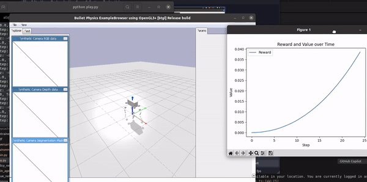
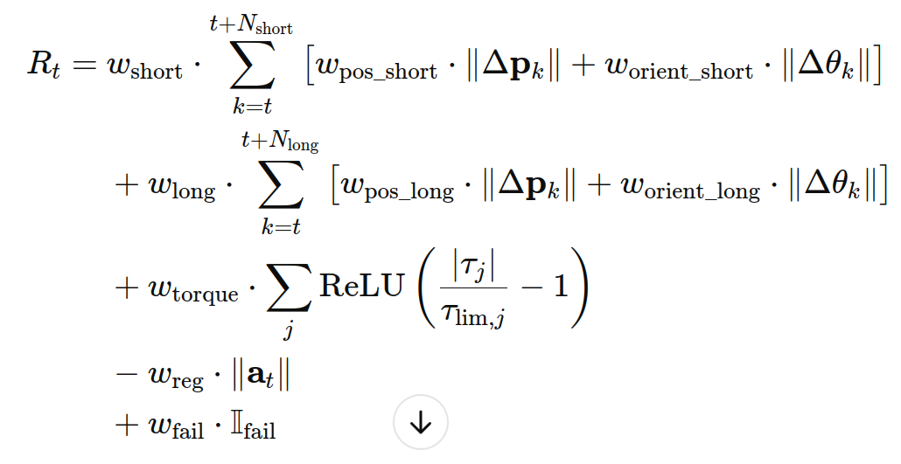
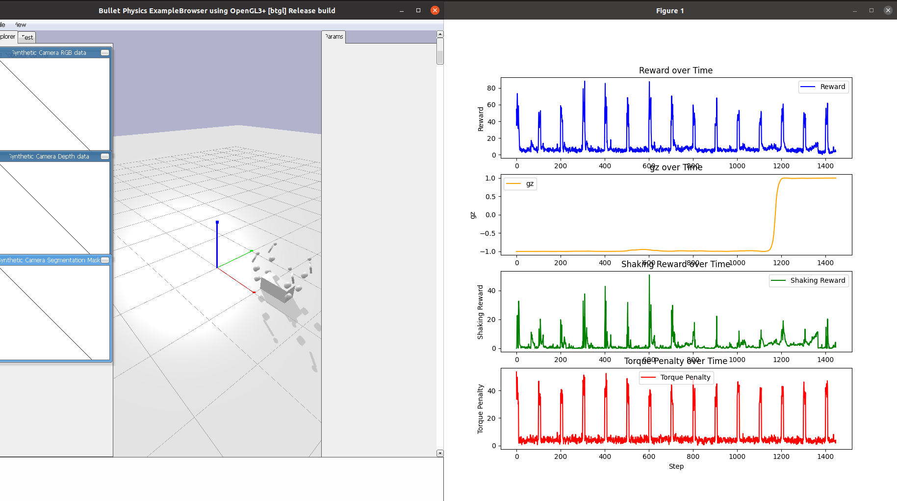
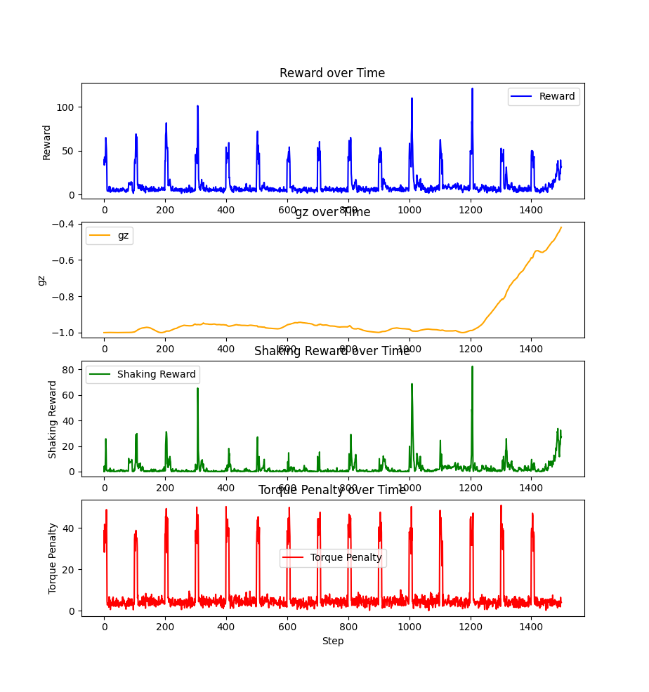
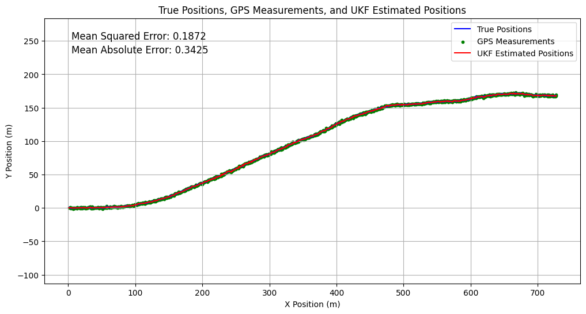
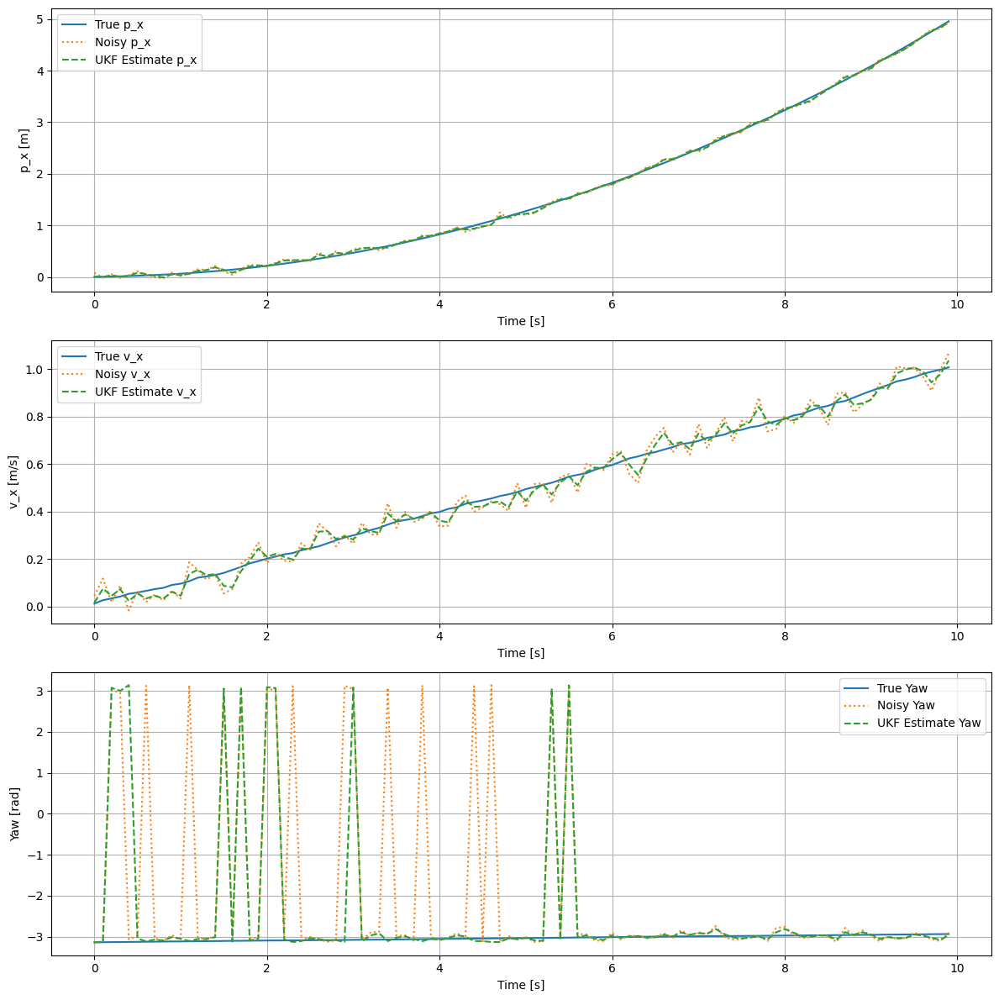

# Quadruped Trajectory Dataset and Live Attack Detection

This project focuses on creating a comprehensive dataset of quadruped robot trajectories under various conditions and developing a real-time system to detect abnormal behaviors or potential attacks.

## Table of Contents

1. [Project Overview](#project-overview)
2. [Dataset Details](#dataset-details)
    - [Simulation Environments](#simulation-environments)
    - [Conditions and Perturbations](#conditions-and-perturbations)
    - [Reinforcement Learning (RL) Agent](#reinforcement-learning-rl-agent)
    - [Reward Function](#reward-function)
    - [Data Collection Process](#data-collection-process)
3. [Live Attack Detection](#live-attack-detection)
    - [Unscented Kalman Filter (UKF)](#unscented-kalman-filter-ukf)
    - [Physics-Informed Neural Networks (PINN)](#physics-informed-neural-networks-pinn)
    - [Detection Mechanism](#detection-mechanism)
4. [Resources](#resources)

---

## Project Overview

This project aims to enhance the safety and reliability of quadruped robots by:

1. **Creating a Diverse Dataset**: Collecting trajectory data of quadruped robots navigating different routes under both normal and abnormal conditions using high-fidelity simulations.
2. **Developing a Live Attack Detection System**: Implementing real-time monitoring to identify and respond to abnormal behaviors or potential attacks, ensuring the robot's operational integrity.

---

## Dataset Details

### Simulation Environments

Data is gathered using the following simulation platforms to ensure diversity and accuracy:

#### **Isaac Gym**: 
NVIDIA’s high-performance simulator for large-scale robotic simulations.

#### **PyBullet**: 
An open-source physics engine suitable for flexible and rapid prototyping.

#### **MuJoCo**: 
A powerful tool for simulating complex robotic dynamics with precise contact modeling.

### Conditions and Perturbations

The dataset includes trajectories captured under:

- **Normal Conditions**:
  - Standard operational parameters.
  - Consistent terrain textures.
  
- **Abnormal Conditions**:
  - **Noise**: Introduction of sensor and actuator noise to mimic real-world imperfections.
  - **Perturbations**: Application of external forces to simulate disturbances like wind or impacts.
  - **Different Plane Textures**: Variations in ground textures to challenge the robot's adaptability.
  - **Physical Attacks**: Simulated adversarial actions targeting the robot’s stability and functionality.

### Reinforcement Learning (RL) Agent

An RL agent is utilized to introduce perturbations that challenge the robot’s trajectory. Inspired by ["Rethinking Robustness Assessment: Adversarial Attacks on Learning-based Quadrupedal Locomotion Controllers"](https://arxiv.org/abs/2405.12424) research, the agent has been updated to consider both short-term and long-term deviations from the main route.

#### Key Features:

- **Short and Long Horizon Planning**: Balances immediate and future trajectory deviations.
- **Adaptive Reward Mechanism**: Encourages the agent to explore diverse perturbation strategies to destabilize the robot effectively.

### Reward Function

The RL agent's behavior is governed by a step-based reward function designed to maximize trajectory deviations and induce potential failure states.

#### Mathematical Formulation

At each time step \( t \), the reward \( R_t \) is:

<!-- $$
\begin{aligned}
R_t =\ & w_{\text{short}} \cdot \sum_{k=t}^{t + N_{\text{short}}} \left[ w_{\text{pos\_short}} \cdot \| \Delta \mathbf{p}_k \| + w_{\text{orient\_short}} \cdot \| \Delta \mathbf{\theta}_k \| \right] \\
& + w_{\text{long}} \cdot \sum_{k=t}^{t + N_{\text{long}}} \left[ w_{\text{pos\_long}} \cdot \| \Delta \mathbf{p}_k \| + w_{\text{orient\_long}} \cdot \| \Delta \mathbf{\theta}_k \| \right] \\
& + w_{\text{torque}} \cdot \sum_j \text{ReLU}\left( \frac{|\tau_j|}{\tau_{\text{lim},j}} - 1 \right) \\
& - w_{\text{reg}} \cdot \| \mathbf{a}_t \| \\
& + w_{\text{fail}} \cdot \mathbb{I}_{\text{fail}}
\end{aligned}
$$ -->

#### Component Breakdown

1. **Trajectory Deviation**:
   - **Short Horizon**: Captures immediate deviations over N_short steps.
   - **Long Horizon**: Captures sustained deviations over N_long steps.

2. **Torque Limit Compliance**:
   - Encourages the agent to exceed joint torque limits, potentially leading to mechanical failures.

3. **Action Regularization**:
   - Penalizes large adversarial actions to promote realistic perturbations.

4. **Terminal Failure Reward**:
   - Provides a substantial reward if the robot fails, reinforcing the achievement of critical failure states.

### Data Collection Process

1. **Simulation Setup**:
   - Configure the quadruped robot model in Isaac Gym, PyBullet, and MuJoCo.
   - Define multiple routes for the robot to traverse.
   - The implementation of each simulation can be found in the following directories:
     - [legged_gym](/legged_gym) directory for Isaac Gym
     - [pybullet_anymal_c](/pybullet_anymal_c) directory for PyBullet
     - [mujoco_mpc](/mujoco_mpc) directory for MuJoCo

2. **Normal Condition Data Gathering**:
   - Execute the robot along predefined routes under standard conditions.
   - Record trajectory data including position, orientation, joint torques, and action vectors.

3. **Abnormal Condition Data Gathering**:
   - Deploy the RL agent to introduce perturbations.
   - Simulate various abnormal conditions and capture the robot's responses.

4. **Data Aggregation and Processing**:
   - Consolidate data from all simulations.
   - Filter out incomplete or erroneous trajectories.
   - Label data to indicate normal or specific abnormal conditions.

[example dataset](state_logs.csv)

---

## Live Attack Detection

The live attack detection system leverages advanced filtering and neural network techniques to monitor the robot's state in real-time and identify abnormal conditions or potential attacks.

### Unscented Kalman Filter (UKF)

**UKF** is utilized for estimating the robot's current state from noisy sensor data.

- **Features**:
  - Handles non-linear dynamics effectively.
  - Provides robust state estimation despite sensor and process noise.

For a detailed example of vehicle movement prediction using UKF and PINN, you can check out the [Jupyter Notebook](Vehicle_Movement_Tracking_with_PINN_UKF.ipynb).

### Physics-Informed Neural Networks (PINN)

**PINN** integrates physical laws into the neural network to ensure that predictions adhere to the robot's underlying physics.

- **Features**:
  - Embeds equations of motion and other physical principles.
  - Enhances the reliability and accuracy of state predictions.

For an implementation instance of UKF-PINN over the legged robot dataset, check out this [Jupyter Notebook](legged_robot_ukf.ipynb).

### Detection Mechanism

1. **State Prediction**:
   - **UKF** estimates the current state based on sensor inputs.
   - **PINN** predicts the next state using the current state and physical laws.

2. **Anomaly Detection**:
   - Compare the predicted next state with the actual next state from sensor data.
   - Calculate the discrepancy between predicted and actual states.

3. **Attack Identification**:
   - If the discrepancy exceeds a predefined threshold, classify it as an abnormal condition or potential attack.
   - Trigger appropriate response mechanisms to mitigate the threat.

4. **Continuous Monitoring**:
   - The system continuously monitors the robot's state, ensuring real-time detection and response to emerging threats.

---

## Resources

- [legged_gym](https://github.com/leggedrobotics/legged_gym) 
- [mujoco_mpc](https://github.com/google-deepmind/mujoco_mpc)
- [Rethinking Robustness Assessment: Adversarial Attacks on Learning-based Quadrupedal Locomotion Controllers](https://arxiv.org/abs/2405.12424)
---